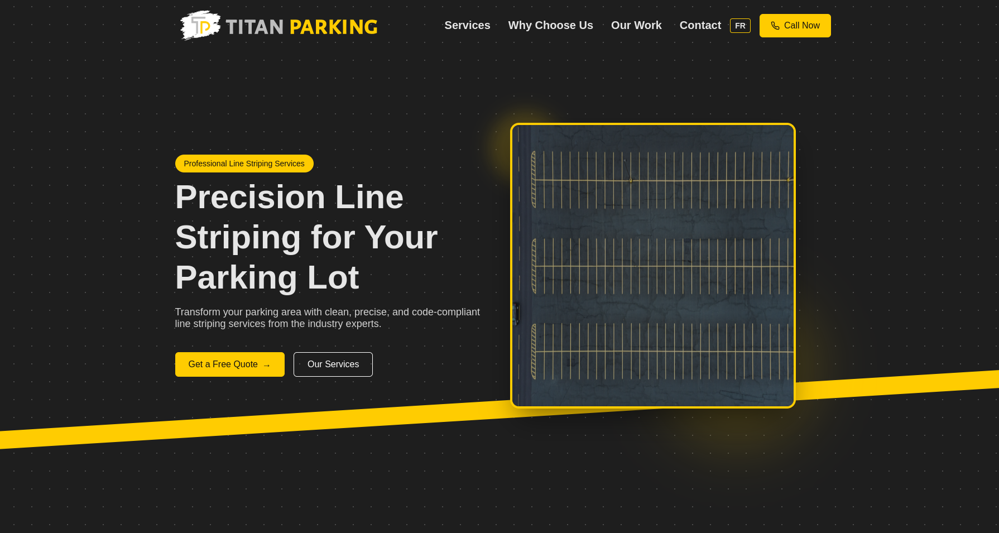

# Titan Parking Website

A professional business website for Titan Parking, a line striping and parking lot service company based in Quebec. The website features a modern, responsive design with a focus on showcasing services, portfolio, and easy quote requests.

  

## 🚀 Features

- **Modern Design**: Clean and professional UI with responsive layout
- **Service Showcase**: Detailed presentation of line striping services
- **Portfolio Gallery**: Visual showcase of completed projects
- **Quote System**: Integrated quote request system
- **Bilingual Support**: Website supports both English and French
- **Contact Forms**: Easy-to-use contact forms for customer inquiries
- **ADA Compliance**: Accessibility-focused design

## 🛠 Technologies Used

- **Frontend**:

  - HTML5
  - CSS3 (Modern layouts with Grid and Flexbox)
  - JavaScript (4.3%)
  - Responsive Design

- **Backend**:

  - Python (25.5%)
  - Django Framework
  - HTMX for dynamic interactions

- **Deployment**:
  - GitHub Actions for CI/CD
  - Gunicorn
  - Systemd service management

## 🌐 Deployment

The project uses GitHub Actions for automated deployment. The deployment workflow:

- Triggers on push to master branch
- Automatically deploys to production server
- Handles static files collection
- Manages database migrations
- Restarts Gunicorn server
